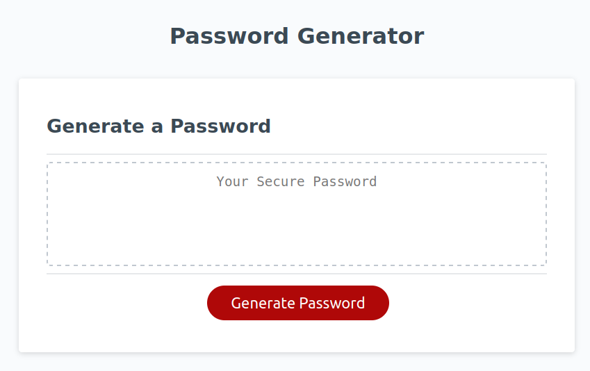

# Javascript Password Generator
This application will securely generate a password for the user following a couple of user-set criteria. [^1]

## About the project
This project was put together as an assignment for my University of Minnesota web development course. 

## Project Criteria

- When the user clicks the generate password button, they are given multiple prompts so they can specify the password criteria.
- When prompted for the password length, they are limited between 8 and 128 characters.
- When prompted for character types, the user can select whether or not to include lowercase, uppercase, numeric, or special characters.
- Once the user answers all the prompts, all the user's inputs must be validated and then a password is generated meeting those criteria.
- Finally, the generated password is written to the page, so the user can copy into a form or login.

## Deployment of project
You can access this password generator at the GitHub Pages live site [here!](https://fixedotter.github.io/passwordGenJS/)

## Screenshot!
This is what the finished project looks like:

[^1]: I would not actually recommend using this for generating passwords. A better way to generate passwords is the dice-generated passphrases. You can learn more about them [here.](https://www.eff.org/dice)